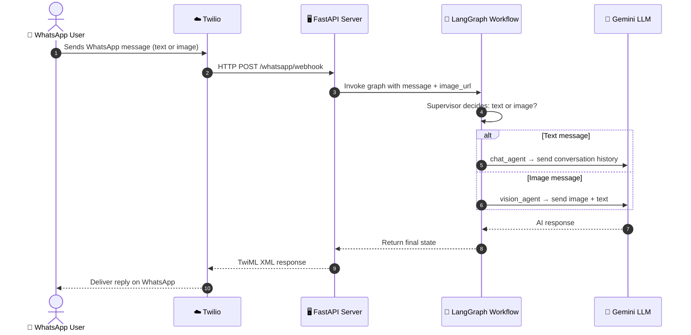
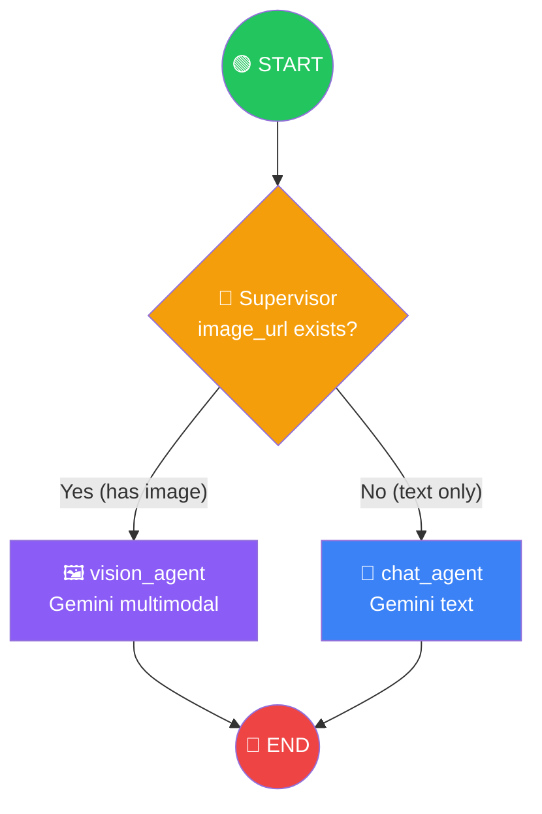
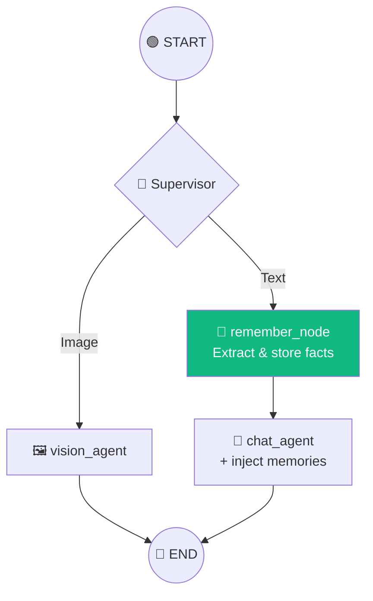

# 🟢 WhatsApp Agent — Step-by-Step Walkthrough

This project is a **WhatsApp chatbot** that uses **LangGraph** to route incoming messages to the right AI agent (text chat or image understanding), with memory so it remembers past conversations.

---

## 📂 File Map — What Each File Does

| File | Role |
|------|------|
| [`main.py`](file:///y:/GitHub/Sachin-Mistra-GenAI/Agents_From_Scratch/WhatsApp_Agent/main.py) | V1 — Simple prototype (no LangGraph, just raw LLM call) |
| [`entrypoint.py`](file:///y:/GitHub/Sachin-Mistra-GenAI/Agents_From_Scratch/WhatsApp_Agent/entrypoint.py) | V2 — FastAPI server that uses the LangGraph workflow |
| [`workflow.py`](file:///y:/GitHub/Sachin-Mistra-GenAI/Agents_From_Scratch/WhatsApp_Agent/workflow.py) | V2 — The LangGraph graph (short-term memory only) |
| [`entrypoint_with_ltm.py`](file:///y:/GitHub/Sachin-Mistra-GenAI/Agents_From_Scratch/WhatsApp_Agent/entrypoint_with_ltm.py) | V3 — FastAPI server with long-term memory |
| [`workflow_with_ltm.py`](file:///y:/GitHub/Sachin-Mistra-GenAI/Agents_From_Scratch/WhatsApp_Agent/workflow_with_ltm.py) | V3 — LangGraph graph + long-term memory via MongoDB |
| [`image_download_helper.py`](file:///y:/GitHub/Sachin-Mistra-GenAI/Agents_From_Scratch/WhatsApp_Agent/image_download_helper.py) | Downloads images from Twilio and converts to base64 |
| [`embedding_setup.py`](file:///y:/GitHub/Sachin-Mistra-GenAI/Agents_From_Scratch/WhatsApp_Agent/embedding_setup.py) | Creates embedding models (used for long-term memory search) |
| [`long_term_memory_helper.py`](file:///y:/GitHub/Sachin-Mistra-GenAI/Agents_From_Scratch/WhatsApp_Agent/long_term_memory_helper.py) | Read/write/extract long-term memories from MongoDB |

---

## 🔁 The Big Picture — How a WhatsApp Message Flows



---

## 🪜 Step-by-Step Breakdown (V2 — The Core Version)

### Step 1: User sends a WhatsApp message

A user types something (or sends a photo) on WhatsApp. Meta forwards it to Twilio, and Twilio makes an HTTP POST to your server.

---

### Step 2: FastAPI receives the webhook — [`entrypoint.py`](file:///y:/GitHub/Sachin-Mistra-GenAI/Agents_From_Scratch/WhatsApp_Agent/entrypoint.py)

```python
@app.post("/whatsapp/webhook")
async def whatsapp_webhook(request: Request):
    form_data = await request.form()

    user_message = form_data.get("Body", "")      # The text the user typed
    from_number = form_data.get("From")            # e.g. "whatsapp:+919876543210"
```

Twilio sends form data with fields like `Body` (message text), `From` (phone number), `NumMedia` (how many attachments), and `MediaUrl0` (image URL if any).

---

### Step 3: Image handling

```python
    num_media = int(form_data.get("NumMedia", 0))
    image_url = None

    if num_media > 0:
        media_type = form_data.get("MediaContentType0", "")
        if "image" in media_type:
            raw_url = form_data.get("MediaUrl0")
            image_url = download_twilio_image_as_base64(raw_url)  # ← helper function
```

If the user sent an image, we download it from Twilio's servers and convert it to a **base64 data URL** (e.g., `data:image/jpeg;base64,/9j/4AAQ...`). This is the format multimodal LLMs expect.

> [!NOTE]
> The image needs authentication to download (Twilio Account SID + Auth Token), which is handled inside [`image_download_helper.py`](file:///y:/GitHub/Sachin-Mistra-GenAI/Agents_From_Scratch/WhatsApp_Agent/image_download_helper.py).

---

### Step 4: Invoke the LangGraph workflow

```python
    config = {
        "configurable": {
            "thread_id": from_number  # ← each phone number gets its own memory thread!
        }
    }

    result = langgraph_app.invoke(
        {
            "messages": [HumanMessage(content=user_message)],
            "image_url": image_url
        },
        config=config
    )
```

**Key LangGraph concepts here:**
- **`thread_id`** → This is how LangGraph remembers conversations. Each phone number is a separate thread, so User A's history is separate from User B's.
- **State input** → We pass the current message and the image URL (or `None`) into the graph.

---

### Step 5: The LangGraph Graph — [`workflow.py`](file:///y:/GitHub/Sachin-Mistra-GenAI/Agents_From_Scratch/WhatsApp_Agent/workflow.py)

This is the heart of the project. Let's break it down piece by piece.

#### 5a. The State Definition

```python
class WhatsAppState(TypedDict):
    messages: Annotated[list, add_messages]   # ← chat history, auto-appends
    image_url: Optional[str]                   # ← base64 image, if any
```

> [!IMPORTANT]
> `Annotated[list, add_messages]` is a LangGraph **reducer**. Instead of replacing the messages list on each step, it **appends** new messages. This is what gives you automatic chat history!

#### 5b. The Supervisor (Routing Logic)

```python
def supervisor(state: WhatsAppState):
    if state.get("image_url"):
        return "vision_agent"    # image attached → go to vision
    return "chat_agent"          # text only → go to chat
```

This is a **conditional entry point**. It's the first thing that runs and decides which node to execute. Think of it as an `if/else` that picks the path through the graph.

The corresponding graph wiring:

```python
graph.set_conditional_entry_point(
    supervisor,
    {
        "chat_agent": "chat_agent",     # if supervisor returns "chat_agent" → go to chat_agent node
        "vision_agent": "vision_agent"  # if supervisor returns "vision_agent" → go to vision_agent node
    }
)
```

#### 5c. Chat Agent Node (Text)

```python
def chat_agent(state: WhatsAppState):
    response = llm.invoke(state["messages"])   # send FULL conversation history
    return {"messages": [response]}            # append AI reply to state
```

Simple: sends the entire message history (remembered across turns via the checkpointer) to Gemini and returns the response.

#### 5d. Vision Agent Node (Image)

```python
def vision_agent(state: WhatsAppState):
    last_user_message = state["messages"][-1].content

    response = llm.invoke([{
        "role": "user",
        "content": [
            {"type": "image_url", "image_url": {"url": state["image_url"]}},
            {"type": "text", "text": last_user_message or "Describe this image"}
        ]
    }])

    return {"messages": [response]}
```

Uses Gemini's **multimodal** capability. Sends both the image and the user's text (if any) in a single message.

#### 5e. Build & Compile the Graph

```python
def build_langgraph_app():
    graph = StateGraph(WhatsAppState)

    graph.add_node("chat_agent", chat_agent)
    graph.add_node("vision_agent", vision_agent)

    graph.set_conditional_entry_point(supervisor, { ... })

    graph.add_edge("chat_agent", END)       # after chat_agent → done
    graph.add_edge("vision_agent", END)     # after vision_agent → done

    langgraph_app = graph.compile(checkpointer=memory)   # ← SQLite memory!
    return langgraph_app
```

> [!TIP]
> **`checkpointer=memory`** is what gives the bot **short-term memory** (conversation history). It's backed by SQLite, so it persists across server restarts.

#### Visual representation of the graph:



---

### Step 6: Send the reply back

```python
    reply = result["messages"][-1].content    # last message = AI's response

    twilio_response = MessagingResponse()
    twilio_response.message(reply)            # wrap in TwiML XML

    return Response(
        content=str(twilio_response),
        media_type="application/xml"
    )
```

Twilio expects a **TwiML XML** response like:
```xml
<Response><Message>Hello! How can I help?</Message></Response>
```

---

## 🧠 V3 — The Long-Term Memory Version

The V3 files ([`workflow_with_ltm.py`](file:///y:/GitHub/Sachin-Mistra-GenAI/Agents_From_Scratch/WhatsApp_Agent/workflow_with_ltm.py), [`entrypoint_with_ltm.py`](file:///y:/GitHub/Sachin-Mistra-GenAI/Agents_From_Scratch/WhatsApp_Agent/entrypoint_with_ltm.py)) add a **long-term memory** system on top of V2. Here's what's different:

### Two Types of Memory

| Memory Type | Storage | What It Remembers | Example |
|---|---|---|---|
| **Short-term** (checkpointer) | SQLite | Full conversation history per thread | "User said 'hi', bot replied 'hello'" |
| **Long-term** (MongoDB + vectors) | MongoDB | Stable user facts extracted by AI | "User's name is Pavan", "Works on GenAI" |

### New Node: `remember_node`



The flow for text messages becomes: **Supervisor → remember → chat_agent → END**

#### How `remember_node` works ([`long_term_memory_helper.py`](file:///y:/GitHub/Sachin-Mistra-GenAI/Agents_From_Scratch/WhatsApp_Agent/long_term_memory_helper.py)):

1. **Read** existing memories from MongoDB for this user
2. **Ask a separate LLM** (Groq) to analyze the new message: _"Is there anything new worth remembering?"_
3. The LLM returns a structured `MemoryDecision`:
   - `should_write: true/false`
   - `memories: [{text: "User is a student", is_new: true}]`
4. **Write** only genuinely new facts to MongoDB (with vector embeddings for search)

#### How `chat_agent` uses memories:

```python
def chat_agent(state, config):
    memories = read_user_memory(user_id, limit=5)   # fetch top 5 memories
    memory_text = "\n".join(m.value["data"] for m in memories)

    system_msg = SystemMessage(
        content=f"Known user context:\n{memory_text}\nUse this information naturally."
    )

    response = llm.invoke([system_msg] + state["messages"])
```

It injects the user's long-term memories into the **system prompt**, so the bot can say things like _"How's your GenAI project going, Pavan?"_ even if you haven't mentioned it in this conversation.

---

## 🔑 Key LangGraph Concepts Used

| Concept | Where | What It Does |
|---|---|---|
| **`StateGraph`** | [`workflow.py:84`](file:///y:/GitHub/Sachin-Mistra-GenAI/Agents_From_Scratch/WhatsApp_Agent/workflow.py#L84) | Creates a graph where state flows between nodes |
| **`add_messages` reducer** | [`workflow.py:36`](file:///y:/GitHub/Sachin-Mistra-GenAI/Agents_From_Scratch/WhatsApp_Agent/workflow.py#L36) | Auto-appends messages instead of overwriting |
| **Conditional entry point** | [`workflow.py:89`](file:///y:/GitHub/Sachin-Mistra-GenAI/Agents_From_Scratch/WhatsApp_Agent/workflow.py#L89) | Routes to different nodes based on a function's return value |
| **Nodes** | [`workflow.py:86-87`](file:///y:/GitHub/Sachin-Mistra-GenAI/Agents_From_Scratch/WhatsApp_Agent/workflow.py#L86-L87) | Functions that transform state (chat_agent, vision_agent) |
| **Edges** | [`workflow.py:97-98`](file:///y:/GitHub/Sachin-Mistra-GenAI/Agents_From_Scratch/WhatsApp_Agent/workflow.py#L97-L98) | Define what node runs after the current one |
| **Checkpointer** | [`workflow.py:100`](file:///y:/GitHub/Sachin-Mistra-GenAI/Agents_From_Scratch/WhatsApp_Agent/workflow.py#L100) | Persists state (conversation history) across invocations |
| **`thread_id`** | [`entrypoint.py:33`](file:///y:/GitHub/Sachin-Mistra-GenAI/Agents_From_Scratch/WhatsApp_Agent/entrypoint.py#L33) | Isolates memory per user (each phone number = one thread) |

---

## 💡 TL;DR

1. **User sends WhatsApp message** → Twilio → your FastAPI server
2. **FastAPI** extracts the text + any image
3. **LangGraph Supervisor** routes: text → `chat_agent`, image → `vision_agent`
4. The chosen **agent calls Gemini** (with conversation history from SQLite)
5. **Response goes back** as TwiML XML → Twilio → user's WhatsApp
6. **(V3 bonus)** Long-term memories are extracted and stored in MongoDB, so the bot remembers user facts forever
